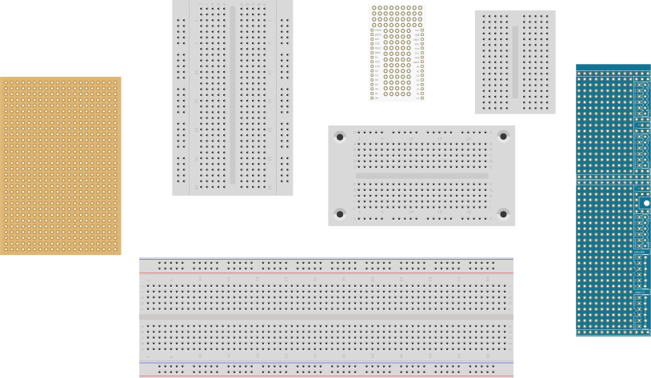

<!--
title: Breadboards
summary: This document describes basic breadboards.
author: G. L. Clark, II
date Created: March 16, 2016
date Modified:{{ file.mtime }}
filename: breadboards.md
-->

# Breadboards[^1]

Breadboards are special boards used to prototyping electronics. They are covered with a grid of holes, which are split into electrically continuous rows. By using a breadboard, you can build a circuit without soldering or twisting wires together. Connect the parts that should be wired together into one of the electrically continuous rows.

<figure>

<figcaption>Various Breadboards</figcaption>
</figure>

In the central part there are two columns of rows that are side-by-side. This allows you to be able to insert an integrated circuit into the center. Once inserted, each pin of the integrated circuit will have a row of holes connected to it.

Typically on each edge of the breadboard are two continuous bus lines. One is intended to be used for power and the other as a ground. By plugging power and ground respectively into each of these, you can access them from anywhere on the breadboard.

#### References

[^1]: http://www.instructables.com/id/Basic-Electronics/step15/Breadboards/