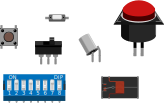

<!--
title: Breadboards
summary: This document describes basic breadboards.
author: G. L. Clark, II
date Created: March 16, 2016
date Modified:{{ file.mtime }}
filename: breadboards.md
-->

# Breadboards[^1]

A switch is basically a mechanical device that creates a break in a circuit. When you activate the switch it opens or closes the circuit depending on the type of switch being used.

<figure>

<figcaption>Various Switches</figcaption>
</figure>

_Normally Open (N.O.)_ switches close the circuit when activated.

_Normally Closed (N.C.)_ switches open the circuit when activated.

As switches get more complex they can both open one connection and close another when activated. This type of switch is a single-pole double-throw switch (SPDT).

If you were to combine two _"SPDT"_ switches into one single switch, it would be called a double-pole double-throw switch (DPDT). This would break two separate circuits and open two other circuits, every time the switch is activated.

<figure>

<figcaption>Various Switches Schematic</figcaption>
</figure>

#### References

[^1]: http://www.instructables.com/id/Basic-Electronics/step13/Switches/