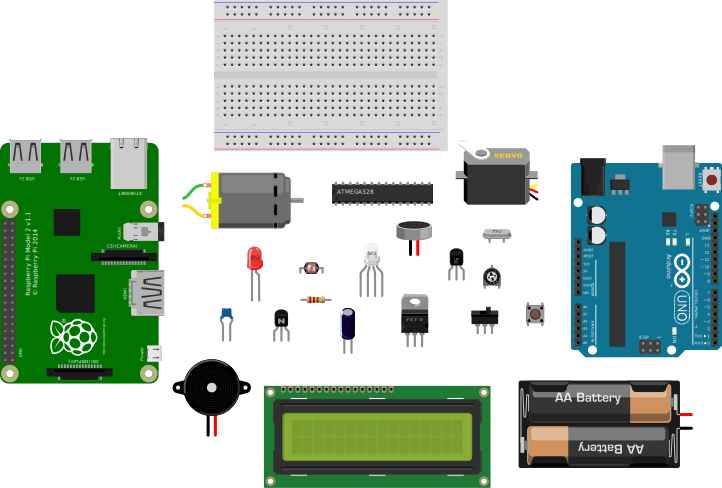

<!---
title: Components
summary: This document describes basic components.
author: G. L. Clark, II
date Created: March 2, 2016
date Modified:{{ file.mtime }}
filename: circuitry-basics.md
--->

# Components[^1]

To build circuits, you will need to become familiar with a few basic components. These components may seem simple, but are the bread and butter of most electronics projects. Take a look at the following pages to learn about some of the basic components.

<figure style="margin: 15px 0; width: 100%; border:1px solid lightgray; text-align:center">

<figcaption style="background-color: aliceblue; border-top: 1px solid lightgray; font-style: italic;">Various Components</figcaption>
</figure>

---

#### References

[^1]: http://www.instructables.com/id/Basic-Electronics/step5/Basic-Components