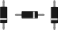

<!--
title: Diodes
summary: This document describes the diode basic component.
author: G. L. Clark, II
date Created: March 6, 2016
date Modified:{{ file.mtime }}
filename: diodes.md
-->

# Diodes[^1]

The most common function of a diode is to allow an electric current to pass in one direction (called the diode's forward direction), while blocking current in the opposite direction (the reverse direction)[^2]. They are useful because they can be placed in a circuit to prevent electricity from flowing in the wrong direction.

<figure>

<figcaption>Diodes</figcaption>
</figure>

It requires energy to pass through a diode which results in a drop of voltage. Typically there is a loss of about 0.7V. This is important to remember as some components in the circuit might not get enough power.

The ring found on one end of the diode indicates the side of the diode which connects to ground. This side is called the cathode. The other side, which is called the anode, connects to power. They are represented in schematic as a line with a triangle pointing at it. The line is the side connected to ground and the bottom of the triangle connects to power.

<figure>

<figcaption>Diodes - Schematic View</figcaption>
</figure>

---

#### References

[^1]: http://www.instructables.com/id/Basic-Electronics/step8/Diodes/
[^2]: https://en.wikipedia.org/wiki/Diode