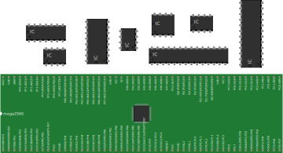
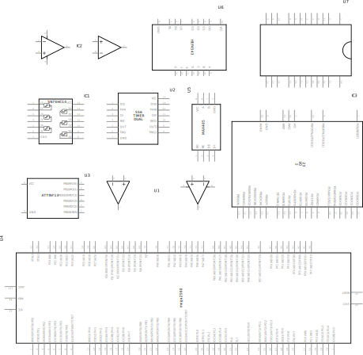

<!--
title: Integrated Circuits (ICs) and Microcontrollers
summary: This document describes integrated circuits and microcontroller component.
author: G. L. Clark, II
date Created: March 6, 2016
date Modified:{{ file.mtime }}
filename: integrated-circuits.md
-->

# Integrated Circuits (ICs)[^1]

An integrated circuit is an entire specialized circuit that has been miniaturized and fit onto a small chip. Each leg of the chip connects to a point within the circuit. These miniaturized circuits typically consist of components such as transistors, resistors, and diodes.

For instance, the internal schematic for a 555 timer chip has over 40 components in it.

Like transistors, you can learn all about integrated circuits by looking up their datasheets. On the datasheet you will learn the functionality of each pin. It should also state the voltage and current ratings of both the chip itself and each individual pin.

Integrated circuits come in a variety of different shapes and sizes. As a beginner, you will be mainly working with DIP chips. These have pins for through-hole mounting. As you get more advanced, you may consider SMT chips which are surface mount soldered to one side of a circuit board.

<figure>

<figcaption>Integrated Circuits</figcaption>
</figure>

The round notch on one edge of the IC chip indicates the top of the chip. The pin to the top left of the chip is considered pin 1. From pin 1, you read sequentially down the side until you reach the bottom (i.e. pin 1, pin 2, pin 3..). Once at the bottom, you move across to the opposite side of the chip and then start reading the numbers up until you reach the top again.

Keep in mind that some smaller chips have a small dot next to pin 1 instead of a notch at the top of the chip.

There is no standard way that all ICs are incorporated into circuit diagrams.They are often represented as boxes with numbers in them, which represent the pin number).

<figure>

<figcaption>Integrated Circuits - Schematic View</figcaption>
</figure>

---

#### References

[^1]: http://www.instructables.com/id/Basic-Electronics/step10/Integrated-Circuits/
[^2]: https://en.wikipedia.org/wiki/Integrated_circuit