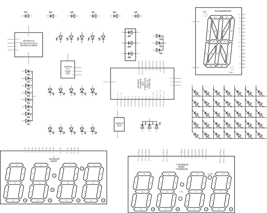

<!--
title: LEDs
summary: This document describes basic LED components.
author: G. L. Clark, II
date Created: March 6, 2016
date Modified:{{ file.mtime }}
filename: led.md
-->

# LEDs[^1]

LED stands for light emitting diode. It is basically a special type of diode that lights up when electricity passes through it. Like all diodes, the LED is polarized and electricity is intended to pass through in one direction.

<figure>

<figcaption>Various LEDs</figcaption>
</figure>

There are typically two indicators to let you know what direction electricity will pass through and LED. The first indicator that the LED will have a longer positive lead (anode) and a shorter ground lead (cathode). The other indicator is a flat notch on the side of the LED to show the positive (anode) lead. Keep in mind that not all LEDs have this indication notch (or that it is sometimes wrong).

Like all diodes, LEDs create a voltage drop in the circuit, but typically do not add much resistance. To prevent the circuit from shorting, you need to add a resistor in series. To figure out how large of a resistor you need for optimum intensity of a single LED, you can an online LED calculator. It is often good practice to use a resistor that is slightly larger in the value than what is returned by calculator.

You may be tempted to wire LEDs in series. Keep in mind that each consecutive LED will result in a voltage drop until there is not enough power left to keep them lit. As such, it is ideal to light up multiple LEDs by wiring them in parallel. You need to ensure that all of the LEDs have the same power rating before you do this. Different colors often are rated differently.

LEDs will show up in a schematic as a diode symbol with lightning bolts coming off of it, to indicate that it is a glowing diode.

<figure>

<figcaption>Various LEDs - Schematic</figcaption>
</figure>

---

#### References

[^1]: http://www.instructables.com/id/Basic-Electronics/step12/LEDs/