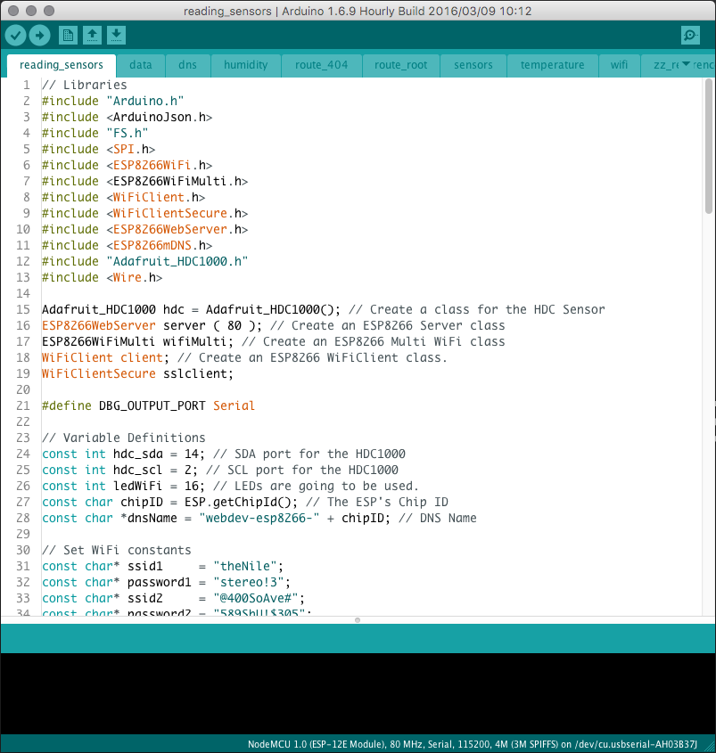

<!--
title: The "Sketch"
summary: This document describes the code that we used for our project.
author: G. L. Clark, II
date Created: March 18, 2016
date Modified:{{ file.mtime }}
filename: sketch.md
-->

# The "Sketch"

Programs written using Arduino Software (IDE) are called sketches. These sketches are written in the text editor and are saved with the file extension .ino[^1]. Our sketch uses a couple of .ino files as a package instead of using one long file. The most recent code is available on [GitHub](https://github.com/shuWebDev/nj-makerDay-2016). 

From the project page, [download the ZIP](https://github.com/shuWebDev/nj-makerDay-2016/archive/master.zip) file by clicking the button on the right hand side. Unzip the file and open "_reading_sensors.ino_" in the [Arduino Software](https://www.arduino.cc/en/Main/Software). This should open all of the files in the project.

<figure>

<figcaption>Final Sketch in Arduino Software.</figcaption>
</figure>

As you can see, there are a few tabs that have opened with the project. Each one of the tabs contain a small portion of the entire program. The first tab is the main program and "sets up" everything up. 

---

#### References

[^1]: https://www.arduino.cc/en/Guide/Environment