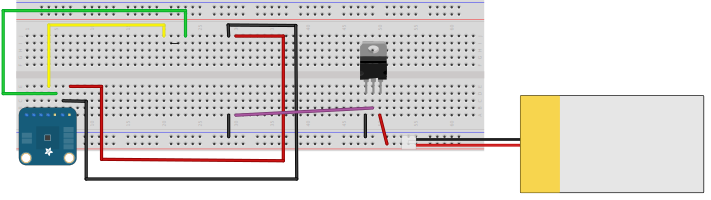

<!--
title: Wire the Circuit
summary: This document describes how we will wire our circuit.
author: G. L. Clark, II
date Created: March 17, 2016
date Modified:{{ file.mtime }}
filename: wire-circuit.md
-->

# Wire the Circuit

<figure>

<figcaption>Temperature and Humidity Circuit</figcaption>
</figure>

The circuit that we are wiring is compromised of two(2) components, the [NodeMCU](nodemcu-devkit.md) and the [HDC1008](sensors.md). We will also need a few jumper wires, a breadboard and a USB or FTDI cable to start. The NodeMCU DevKit makes it easy to program via USB or serial cable, which will also serve as our power supply. 