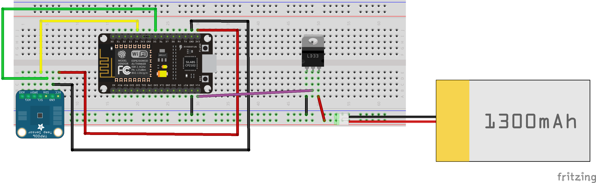

<!--
title: Wire the Circuit
summary: This document describes how we will wire our circuit.
author: G. L. Clark, II
date Created: March 17, 2016
date Modified:{{ file.mtime }}
filename: wire-circuit.md
-->

# Wire the Circuit

The circuit that we are wiring is compromised of two(2) components, the [NodeMCU](nodemcu-devkit.md) and the [HDC1008](sensors.md). We will also need a few jumper wires, a breadboard and a USB or FTDI cable to start. The NodeMCU DevKit makes it easy to program via USB or serial cable, which will also serve as our power supply. 

Start by adding your components to the breadboard, as seen in the following diagram.

<figure>

<figcaption>Temperature and Humidity Circuit</figcaption>
</figure>

Once you've placed the components on the board, connect the sensor to the ESP8266 as follows:

| HDC1008 | ESP8266 |
| -- | -- |
| VIN | 3v3 |
| GND | GND |
| SCL | D5 / GPIO14 | 
| SDA | D6 / GPIO12 |

If you are using the FTDI cable instead of the USB, then you will also need to add the following:

| FTDI | ESP8266 |
| -- | -- |
| Red | VIN |
| Black | GND |
| Yellow | TX | 
| Orange | RX |

Now that everything is wired together, the next step is to program the ESP8266 with an Arduino Sketch.